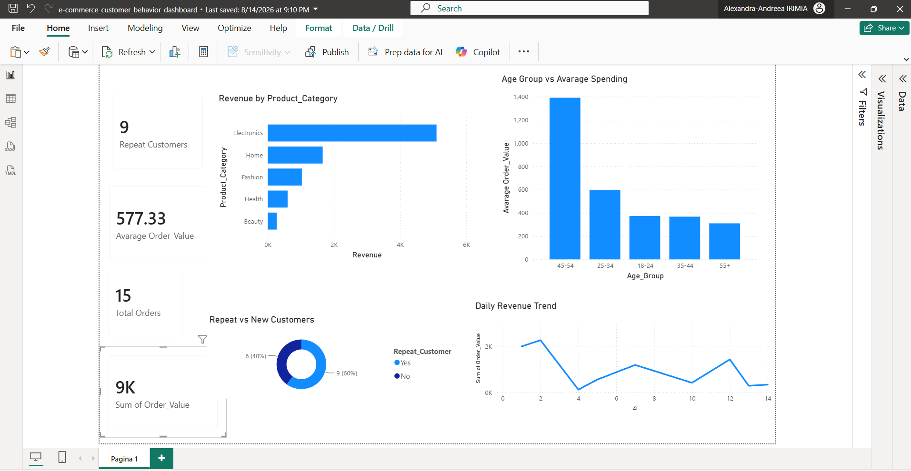

# E-commerce Customer Behavior Dashboard

Dashboard Power BI pentru analiza comportamentului clienților unui magazin online: venituri pe categorii de produse, cheltuieli medii pe grupe de vârstă, rata clienților recurenți și evoluția zilnică a veniturilor.

## Fișiere din proiect

| Fișier | Descriere |
|---|---|
| `e-commerce_customer_behavior_dashboard.pbix` | Fișierul Power BI (raport + model de date) |
| `ecommerce_customer_behavior.xlsx` | Sursa de date brută (comenzi individuale) |
| `dashboard-overview.png` | Captură de ecran cu dashboard-ul final |

## Structura datelor

| Coloană | Tip | Descriere |
|---|---|---|
| `OrderID` | text | Identificator unic al comenzii (ex. A0001) |
| `CustomerID` | text | Identificator unic al clientului (ex. C001) |
| `Age_Group` | text | Grupa de vârstă (18-24, 25-34, 35-44, 45-54, 55+) |
| `Gender` | text | Genul clientului |
| `Product_Category` | text | Categoria produsului (Electronics, Fashion, Home, Beauty, Health) |
| `Order_Value` | numeric | Valoarea comenzii |
| `Repeat_Customer` | text | Client recurent (Yes/No) |
| `Order_Date` | dată | Data comenzii (1–14 august 2026) |

## Conținutul dashboard-ului 

**KPI carduri**
- Repeat Customers: 9
- Average Order Value: 577.33
- Total Orders: 15
- Sum of Order Value: 9K

**Vizualizări**
- **Revenue by Product_Category** – grafic bară orizontală; Electronics domină clar veniturile, urmat de Home, Fashion, Health și Beauty.
- **Age Group vs Average Spending** – grafic bară verticală; grupa 45-54 are cea mai mare cheltuială medie, urmată de 25-34.
- **Repeat vs New Customers** – grafic gogoașă (donut); 60% clienți noi, 40% recurenți.
- **Daily Revenue Trend** – grafic linie cu evoluția veniturilor zilnice pe perioada analizată.

## Observații / insight-uri rapide

- Categoria **Electronics** generează cea mai mare parte din venituri, fiind și cea cu cele mai mari valori individuale ale comenzilor.
- Clienții din grupa **45-54 ani** cheltuiesc cel mai mult per comandă, deși nu sunt cei mai numeroși.
- Rata de retenție este de **40%** (6 din 15 clienți sunt recurenți) — spațiu de îmbunătățire pentru campanii de loializare.
- Setul de date este mic (15 comenzi) — pentru concluzii statistice solide ar fi util un volum mai mare de date istorice.

## Posibile extinderi

- Adăugare filtru interactiv pe interval de date și categorie de produs.
- Segmentare pe gen (Gender) pentru analiza cheltuielilor.
- Calcul CLV (Customer Lifetime Value) per client.
- Conectare la o sursă de date live (SQL/API) în locul fișierului Excel static.
